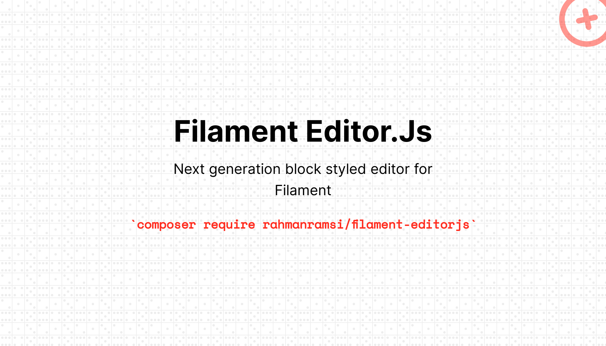

# Filament EditorJs


[](https://packagist.org/packages/rahmanramsi/filament-editorjs)
[](https://packagist.org/packages/rahmanramsi/filament-editorjs)

[EditorJs](https://editorjs.io/) integration for Filament Admin/Forms.

## Installation

You can install the package via composer:

```bash
composer require rahmanramsi/filament-editorjs
```

## Usage

```php
use FilamentEditorJs\Forms\Components\EditorJs;

EditorJs::make('content')

```

## Customization

### Tools

By default all tools are enabled. This is a list of available tools:

```php
[
    'header',
    'image',
    'delimiter',
    'list',
    'underline',
    'quote',
    'table',
    'raw',
    'code',
    'inline-code',
    'style',
]
```

You can disable any of them using by passing an array of tool names:

```php
EditorJs::make('content')->disableTools(['image', 'raw']);
```

Also you can enable only certain tools:

```php
EditorJs::make('content')->tools(['image', 'raw']);
```

## Changelog

Please see [CHANGELOG](CHANGELOG.md) for more information on what has changed recently.

## Contributing

Please see [CONTRIBUTING](https://github.com/spatie/.github/blob/main/CONTRIBUTING.md) for details.

## Security Vulnerabilities

Please review [our security policy](../../security/policy) on how to report security vulnerabilities.

## Credits

- [All Contributors](../../contributors)

## License

The MIT License (MIT). Please see [License File](LICENSE.md) for more information.
